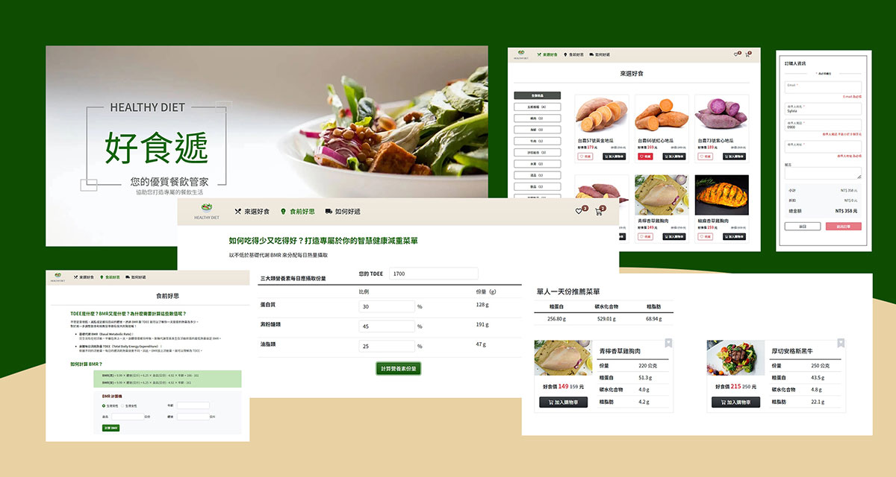
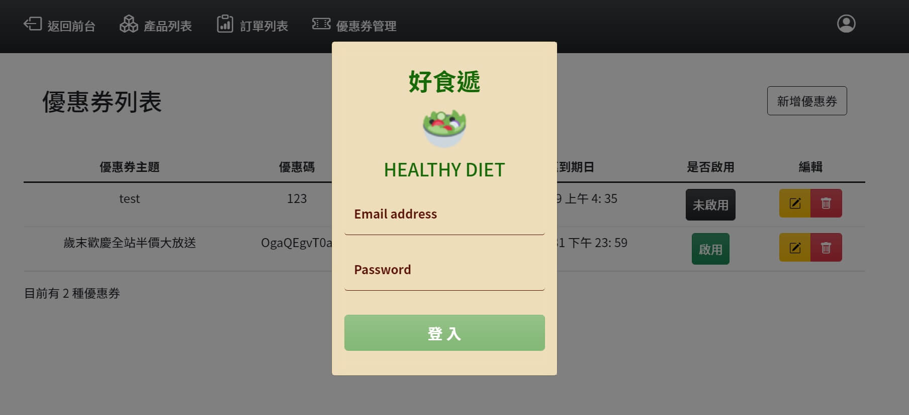
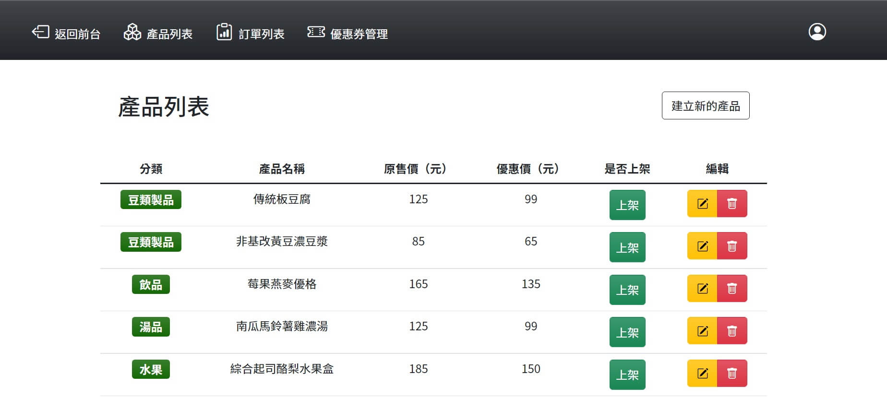
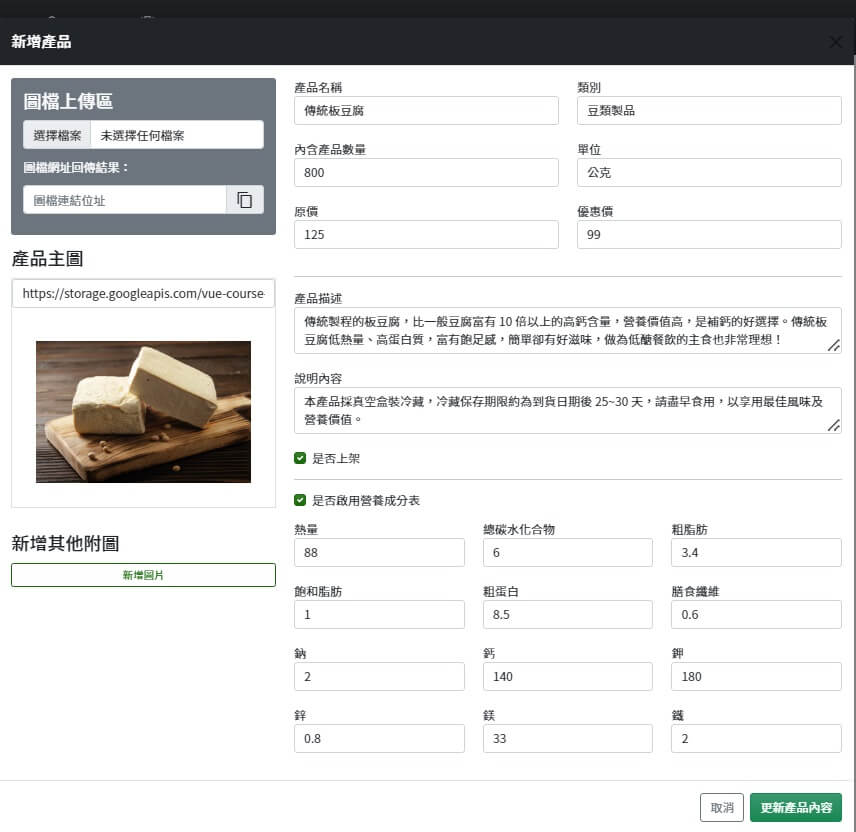
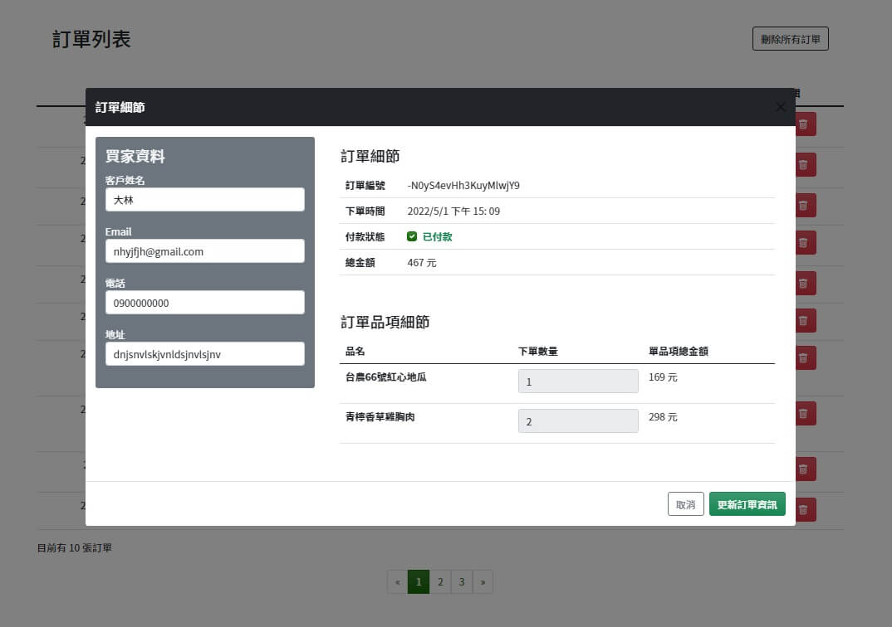
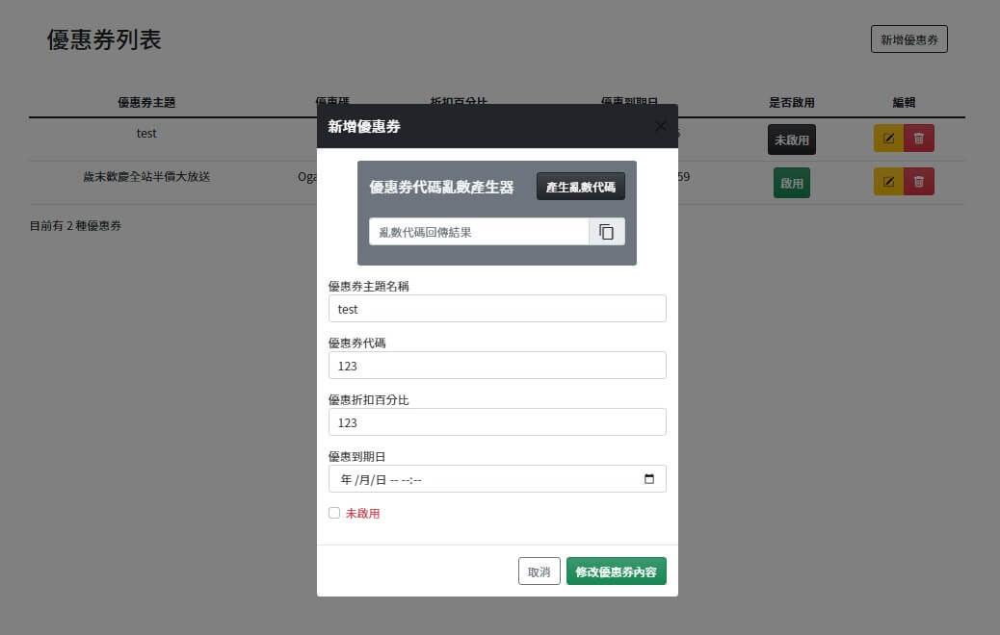

# 好食遞 HealthyDiet
## [Demo Website](https://sylvia-h.github.io/HealthyDiet/#/)

### Tech Stack
* 本專案使用 Vue 3 與 Vue Cli 進行開發
* 以 Bootstrap 5 作為基礎框架，進一步修改參數及 SCSS 檔案，以為此專案所用
* 採用 ESLint Airbnb Style 統一規範程式碼結構與風格
* 使用 AOS、swiper、vue-loading-overlay 等套件增添畫面動態效果
* 使用 Vee-Validation 套件進行結帳流程的表單驗證

### Packages
* Vue 3
* Vue Cli
* Vue Router
* Vue Axios
* vue-loading-overlay
* Vee Validation
* VueLazyLoad
* Bootstrap 5
* AOS
* Swiper
* sweetalert2
* Bootstrap-icons
* material-design-icons-iconfont

### 前台

#### 來選好食
* 依據類別篩選商品
* 將喜愛的商品加入「我的收藏」列表
* 滑鼠滑過商品卡片時有陰影以及圖片放大效果
* 產品加入購物車及「我的收藏」，加入成功或失敗，會以 ToastMessage 來呈現提示訊息

#### 食前好思
* 顧客可以使用頁面中的三個計算器來計算個人的 BMR 及 TDEE
* 計算器會自動帶入上一個計算器的計算結果，方便使用者進行操作
* 最後一個計算器計算出結果的同時，最下方也會同步顯示單人一天份推薦菜單，增加轉換率

#### 如何好遞
* 引導顧客使用本網站
* 退貨條款以及聯絡資訊

#### 我的收藏
* 以表格形式呈現加入「我的收藏」的商品
* 依據不同裝置大小，列表呈現的資訊量也會有所調整

#### 購物車
* 加入新商品時，購物車會針對三大營養素進行加總計算
* 導覽列的購物車 icon 右上角會顯示購物車內商品總數量
* 當購物車內沒有商品時，結帳按鈕會隱藏，並引導顧客進入商場選購

### 後台
#### Login
* 前台頁尾 Footer 有「後台」字樣，點選後會彈跳出 Login 視窗

#### 產品列表

* 點選「上架」按鈕可切換上架、下架狀態
* 點選「建立新產品」會彈跳出編輯商品的視窗
* 點選黃色編輯按鈕會將商品細節資訊帶入編輯商品的視窗中，可以修改商品細節

* 編輯商品視窗中，設計有圖檔上傳區，可以選擇本機端圖檔上傳雲端圖床。圖檔上傳成功後回傳網址，可以直接點選 icon 按鈕進行網址複製

#### 訂單列表

* 點選「未付款」、「未付款」按鈕可切換已付款、未付款狀態
* 點選「刪除所有訂單」可一次性清除所有訂單資訊
* 點選黃色編輯按鈕會將訂單細節資訊帶入編輯訂單的視窗中，可以修改訂單細節

#### 優惠券列表
* 點選「啟用」、「未啟用」按鈕可切換優惠券啟用狀態
* 點選「新增優惠券」會彈跳出編輯優惠券的視窗
* 點選黃色編輯按鈕會將優惠券細節資訊帶入編輯優惠券的視窗中，可以修改優惠券細節

* 編輯優惠券視窗中，設計有「優惠券代碼亂數產生器」，可隨機產生 10 碼優惠券代碼，點選 icon 按鈕可直接複製使用
